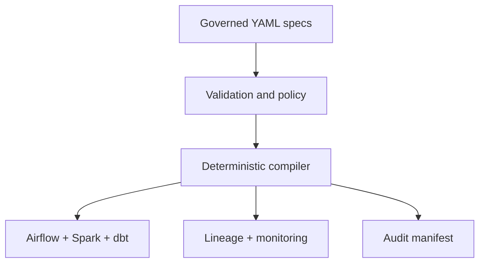

# Metadata-Driven Data Platform

A production-oriented control plane that turns governed YAML pipeline specifications into deployable Airflow, Spark, dbt, OpenLineage, and Prometheus assets.

This repository demonstrates a senior data-engineering pattern: make the platform reusable, put policy in metadata, validate changes before deployment, and preserve an auditable compilation manifest.

## What this proves

- One declarative contract generates orchestration, processing, transformation, lineage, monitoring, and audit assets.
- Schema evolution is classified as compatible or breaking before release.
- Dependencies are validated and topologically ordered; cycles fail fast.
- Compilation is deterministic: the same input creates the same checksums.
- Generated code is syntax-checked in CI and every example pipeline is tested.

## Architecture



## Included pipelines

| Pipeline | Pattern | Business purpose |
|---|---|---|
| `members_cdc` | CDC merge | Maintain a current member dimension |
| `claims_daily` | Scheduled batch | Publish curated daily claims |
| `payments_streaming` | Streaming | Process payment events with low latency |

## Run locally

Requires Python 3.11+.

```bash
python3 -m pip install -r requirements.txt
make test
make demo
```

Generated files are written to `artifacts/generated/`. To compile specs directly:

```bash
PYTHONPATH=src python3 scripts/compile_platform.py \
  --spec-dir pipelines \
  --output artifacts/generated
```

## Repository map

- `pipelines/` — governed source specifications
- `src/metadata_platform/` — validator, registry, compiler, and compatibility engine
- `artifacts/generated/` — reproducible generated deployment assets
- `tests/` — unit and integration coverage
- `docs/` — architecture, onboarding, and governance decisions

## Production mapping

The generated Spark and Airflow files are intentionally portable reference implementations. In a deployed environment, CI publishes generated assets to the organization artifact registry, Terraform installs them, and the platform records the compilation manifest alongside the release.

## Evidence, not inflated claims

`make demo` compiles all included pipelines, syntax-checks generated Python, recompiles into a temporary directory, and verifies identical manifest checksums. It does not claim production scale without a production workload.

## Author

**Prithvi Shetty** — Senior Data Engineer  
Azure · AWS · Databricks · Spark · Kafka · Airflow · dbt · Terraform

